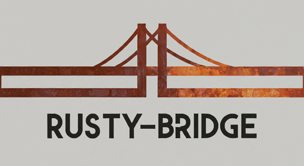
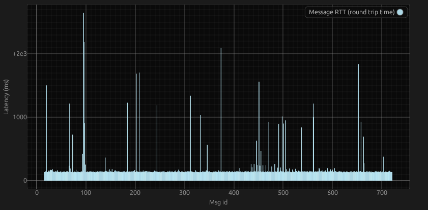

<!-- Improved compatibility of back to top link: See: https://github.com/othneildrew/Best-README-Template/pull/73 -->
<a name="readme-top"></a>
<!--
*** template pulled from https://github.com/othneildrew/Best-README-Template
-->


<!-- PROJECT SHIELDS -->
<!--
*** I'm using markdown "reference style" links for readability.
*** Reference links are enclosed in brackets [ ] instead of parentheses ( ).
*** See the bottom of this document for the declaration of the reference variables
*** for contributors-url, forks-url, etc. This is an optional, concise syntax you may use.
*** https://www.markdownguide.org/basic-syntax/#reference-style-links
-->
[![Rust][rust-shield]][rust-url]
[![Linux][linux-shield]][linux-url]
[![Windows][windows-shield]][windows-url]

<!-- PROJECT LOGO -->
<br />
<div align="center">
  <a href="https://github.com/RockyGitHub/rusty-bridge">
    
  </a>

<h3 align="center">Rusty-Bridge</h3>

  <p align="center">
    A blazingly fast and ultra small solution for message transfer from point A to point B
    <br />
    <a href="https://github.com/RockyGitHub/rusty-bridge"><strong>[todo] Explore the docs »</strong></a>
    <br />
    <br />
    <a href="">[todo] View Demo</a>
    ·
    <a href="https://github.com/RockyGitHub/rusty-bridge/issues/new?labels=bug&template=bug-report---.md">Report Bug</a>
    ·
    <a href="https://github.com/RockyGitHub/rusty-bridge/issues/new?labels=enhancement&template=feature-request---.md">Request Feature</a>
  </p>
</div>


<!-- TABLE OF CONTENTS -->
<details>
  <summary>Table of Contents</summary>
  <ol>
    <li>
      <a href="#about-the-project">About The Project</a>
      <ul>
        <li><a href="#built-with">Built With</a></li>
      </ul>
    </li>
    <li>
      <a href="#getting-started">Getting Started</a>
      <ul>
        <li><a href="#prerequisites">Prerequisites</a></li>
        <li><a href="#installation">Installation</a></li>
      </ul>
    </li>
    <li><a href="#usage">Usage</a></li>
    <li><a href="#roadmap">Roadmap</a></li>
    <li><a href="#contributing">Contributing</a></li>
    <li><a href="#contact">Contact</a></li>
    <li><a href="#acknowledgments">Acknowledgments</a></li>
  </ol>
</details>


<!-- ABOUT THE PROJECT -->
## About The Project
> :warning: If you are interested in this project, please contact me. I am not supporting it or working on it further at the moment, and it likely may not compile without some configuration first as I stopped working on it, mid-changes.

This project is not currently in development, but it's here for my own review or others to review as there were many fun techniques used to implement abstraction and maintain speed. It is not finished but I lost interest in continuing it further for now. It likely won't compile right away either. If you are interested in this project, feel free to contact me.

Rusty-Bridge is a program to build flexible data transformations and sending from point A to point B. It is built to be highly modular. It can be built to accept data from any source, and to send it to any destination. In between, it can be configured to work with all kinds of data transforms, message persistence, metrics viewing, configuration strategy, and more.

Rusty-Bridge can be built for almost any system. It runs with a tiny footprint and fast performance. It is designed to make adding connectivity between any two points, a breeze. Ballpark figures put the figures undder, Size: 10MB, RAM: under 12MB, CPU @ 200msg/s, ~1%. Of course, this is system dependent.

<p align="right">(<a href="#readme-top">back to top</a>)</p>

### Built With

* [![Rust]][rust-url]
* ![love-shield]

<p align="right">(<a href="#readme-top">back to top</a>)</p>


<!-- GETTING STARTED -->
## Getting Started

Rusty-Bridge is designed to be easy to get up and running

### Prerequisites

You will need these tools to compile Rusty-Bridge
* Rust
  ```sh
  # https://www.rust-lang.org/tools/install
  curl --proto '=https' --tlsv1.2 -sSf https://sh.rustup.rs | sh
  ```

### Build and Run

1. Clone the repo
   ```sh
   git clone https://github.com/RockyGitHub/rusty-bridge.git &&
   cd rusty-bridge
   ```
2. Run -- _This currently won't work without specifying the feature flags, but I am pursuing reactivating the `dev` default features_
   ```sh
   cargo run
   # You can specify additional logs with an env var
   RUST_LOG=debug cargo run
   ```
3. Build for release
   ```sh
   cargo build --features="cloud-adapter/special-hivemq, data-source/dev, mini-config/dev" --release
   # Add the target if you are trying to compile for a different target architecture
   # ex: --target=armv7-unknown-linux-gnueabihf     or    --target=x86_64-pc-windows-gnu
   # See this page possible targets: https://doc.rust-lang.org/rustc/platform-support.html
   ```
4. You can also use a pre-made script found in the [tools](https://github.com/RockyGitHub/rusty-bridge/tree/latest/tools) directory

<p align="right">(<a href="#readme-top">back to top</a>)</p>


<!-- USAGE EXAMPLES -->
## Usage

Rusty-Bridge is built out of many different libraries. This helps keep things manageable, resusable, and testable. The project uses what's known as a [workspace](https://doc.rust-lang.org/book/ch14-03-cargo-workspaces.html). This means there are many projects within this one project. For example, Special-AnA is handled within one library, special-hivemq uses that library, and North-Adapters compiles in special-hivemq if the feature flag is selected.

A cool element to this is that testing and example code is extremely easy within each of these libraries. A few of them include an example binary that gives a brief view on how to use the library. It's particularly handy for quick tests and seeing how the code is to be used.

Rusty-Bridge supports providing real-time metrics about its activity. This is one of my favorite parts. See the [docs here](https://github.com/RockyGitHub/rusty-bridge/tree/latest/tools/metrics-viewer/README.md)

Example of RTT (round trip time) for msgs:


Device reporting is also used, information will be sent containing system data on startup and thereafter dynamic data, such as memory available, processor use, etc, is sent. The intent is to serve a page in which all connected edges can be discovered. This page does not exist yet but in the tools directory, you can [find a service](https://github.com/RockyGitHub/Rusty-Bridge/tree/latest/tools/edge_report_listener) to host a local endpoint. It can be used to test this feature.

<!-- _For more examples, please refer to the [Documentation](https://github.com/RockyGitHub/Rusty-Bridge)_ -->

<!-- Modules -->
### Supported Modules
Rusty-Bridge supports a multitude of configurations. The most commonly changed modules include the [Data-Source](data-source-docs), [North-Adapter](north-adapter-docs), [Configuration](config-docs), and the [Transform](transform-docs). There are many other configurable options as well, please see [these docs](all-modules) to review those.

When building with `cargo build` you can specify the features to be built with it by passing the features flag. For example, 
```sh
cargo build --features="data-source/mqtt, cloud-adapter/special-hivemq"
```

Every module has a `dev` option that is used by default

#### Data-Source
`data-source/<option>`
- [![MQTT][mqtt-shield]][data-source-mqtt-url] - `mqtt`
- [![HTTP_REST][http_rest-shield]][data-source-http_rest-url] - `http-rest`

#### North-Adapter
`cloud-adapter/<option>`
- [![HiveMQ][hivemq-shield]][na-hivemq-url] - `special-hivemq`

#### Transform
`msg-transforms/<option>`

#### Configuration
`mini-config/<option>`
- ![toml-shield] - `toml` *currently within `dev` instead

---

Additional Feature flags

#### Data-Server
`Rusty-Bridge/<option>`
- `data-server` [default]
- `none`

#### Persistence
_Not implemented yet_
`msg-persistence/<option>`
- `sled`

#### Alarms
_Not implemented yet_

#### Command and Control
_Not implemented yet_


<p align="right">(<a href="#readme-top">back to top</a>)</p>

<!-- ROADMAP -->
## Roadmap
(not currently in development)
- [ ] [Device Management]
- [ ] Persistence
    - [ ] sled
- [ ] Alarm module
- [ ] Command and Control module
- [ ] Zero-Transform
- [ ] File Uploader

Don't see what you want? [Suggest it!](https://github.com/RockyGitHub/rusty-bridge/issues/new?labels=enhancement&template=feature-request---.md)

See the [open issues](https://github.com/RockyGitHub/rusty-bridge/issues) for a full list of proposed features (and known issues).

<p align="right">(<a href="#readme-top">back to top</a>)</p>


<!-- CONTRIBUTING -->
## Contributing

1. todo

<p align="right">(<a href="#readme-top">back to top</a>)</p>

<!-- CONTACT -->
## Contact

Christopher Davidoff - [email](todo)

<p align="right">(<a href="#readme-top">back to top</a>)</p>


<!-- ACKNOWLEDGMENTS -->
## Acknowledgments

<p align="right">(<a href="#readme-top">back to top</a>)</p>


<!-- MARKDOWN LINKS & IMAGES -->
<!-- https://www.markdownguide.org/basic-syntax/#reference-style-links -->
[product-screenshot]: misc/images/screenshot.png
[Rust]: https://img.shields.io/badge/Rust-000000?style=for-the-badge&logo=rust&logoColor=white
[rust-shield]: https://img.shields.io/badge/Rust-000000?style=for-the-badge&logo=rust&logoColor=white
[rust-url]: https://rust-lang.org/
[love-shield]: https://img.shields.io/badge/❤️Love️-pink?style=flat&logo=heart&labelColor=pink
[toml-shield]: https://img.shields.io/badge/TOML-limegreen?style=flat&logo=toml&labelColor=limegreen


<!-- Platforms -->
[linux-shield]: https://img.shields.io/badge/Linux-FCC624?style=for-the-badge&logo=linux&logoColor=black
[linux-url]: https://www.linux.org/
[windows-shield]: https://img.shields.io/badge/Windows-0078D6?style=for-the-badge&logo=windows&logoColor=white
[windows-url]: https://www.microsoft.com/en-us/windows

<!-- Services -->
[mqtt-shield]: https://img.shields.io/badge/MQTT-606?logo=mqtt&logoColor=fff&style=flat
[hivemq-shield]: https://img.shields.io/badge/HiveMQ-FFC000?logo=hivemq&logoColor=000&style=flat
[hivemq-url]: https://www.hivemq.com/
[http_rest-shield]: https://img.shields.io/badge/HTTP_REST-blue

<!-- Data Source URLs -->
[data-source-http_rest-url]: https://github.com/RockyGitHub/rusty-bridge
[data-source-mqtt-url]: https://github.com/RockyGitHub/rusty-bridge

<!-- North Adapter URLs -->
[na-hivemq-url]: https://github.com/RockyGitHub/rusty-bridge

<!-- Configuration URLs -->

Thank you
