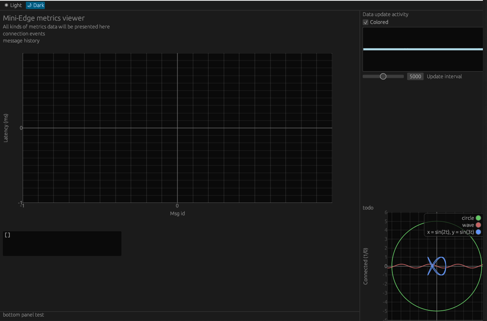
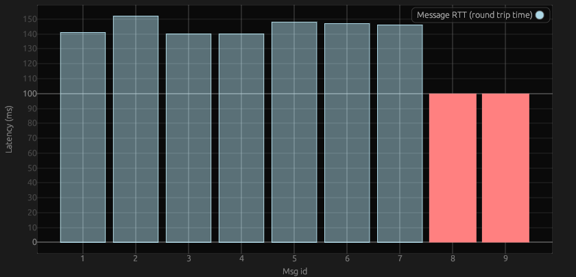

_This page is under construction_
# Metrics Viewer


The metrics-viewer is a WASM app built in Rust. It is intended to ship with the rusty-bridge as an optional feature, but I have not packaged the two together yet.

This is how to use the Metrics Viewer seperately.


<!-- GETTING STARTED -->
## Getting Started

### Prerequisites

You will need these tools to compile rusty-bridge
* Rust
  ```sh
  # https://www.rust-lang.org/tools/install
  curl --proto '=https' --tlsv1.2 -sSf https://sh.rustup.rs | sh
  ```
* wasm target
    ```sh
    rustup target add wasm32-unknown-unknown
    ```
* Trunk
  ```sh
  # https://trunkrs.dev/
  cargo install --locked trunk
  ```

### Build and Run

Host the wasm app locally
```sh
trunk serve
```
Then just go to the endpoint, trunk defaults to localhost:8080

Or build it to generate the distributable
```sh
trunk build --release
```
A `dist` directory will be generated and can be served from anywhere. I intend on having the rusty-bridge able to serve the app, itself


## How it works
You should find a page like this:



This app is only a POC. What it currently has is a large graph in the center that will display message round trip times. Messages that have not received an Ack from the server appear as a red bar. The top right line graph shows activity in fetching data from rusty-bridge. The slider underneath it controls how often the rusty-bridge api is hit to update the app.



Referring back to the original app image, the text box in the bottom left displays a text entry of connection events. The graph in the bottom right does nothing, I was testing out drawing a graph such as that

For now, the web app must run in the same local network as rusty-bridge, but this can be changed in the future. The wasm app runs in your own browser, so it should run for smart phones as well. Although for the moment, if you run it through your phone, it won't be able to reach the rusty-bridge (yet).

## Additional Notes

The endpoints used to retrieve information are currently:

- GET http://127.0.0.1:9000/connection_events
- GET http://127.0.0.1:9000/msg_events


